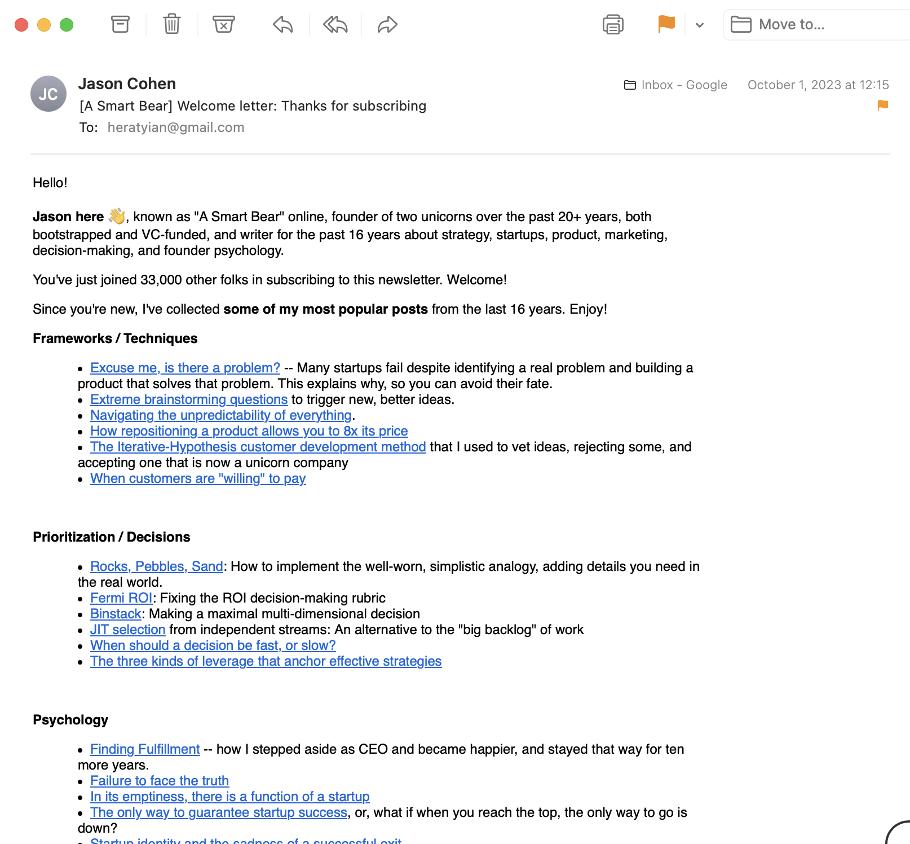
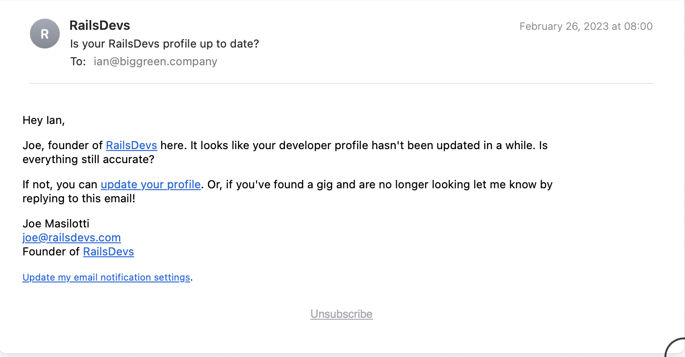

> "If I had asked people what they wanted, they would have said faster horses."
>
> -Henry Ford

> > "A lot of times, people don’t know what they want until you show it to them."
> 
> —Steve Jobs

<!--
this does NOT mean don't talk to users

DON'T BE FAKE STEVE JOBS

Talk to as many users as you can
-->

---

- Best developers maintain a direct connection to users.
- Conversely, it is often a bad sign if developers do not encounter *any* user feedback

<!-- 
- wufoo/37signals have developers take customer support calls once a week/month
 -->
---

# The mistake you will make

> You will make up some idea in your head that you will call your vision. And then you will spend a lot of time thinking about your vision in a cafe by yourself and build some elaborate thing without going and talking to users because that’s doing sales, which is as pain and they might say no… You will not ship fast enough because you’re embarrassed to ship something unfinished and you don’t want to face the likely feedback you will get, so you will shrink from contact with your users.
>
> When in reality, you’d be better off finding someone with a problem they will pay you to fix and then seeing if you can find more people like that.
>
> The best case scenario is that it’s a problem you yourself have.
> 
> - Paul Graham

[source](https://x.com/StartupArchive_/status/1779842017818038308)

---

# Product development lifecycle

1. Idea 💡
2. Launch something 🚀
3. Talk to users to see if it serves their needs 🗣️
4. Repeat 🔁

---

- Listen to what users say, but more importantly, **focus on what they do**.
<!-- - Listen for user problems (You can usually ignore their proposed solutions) -->
- If a user is "hacking" your product in a way you didn't expect, double down on that.

<!-- users own the problem, you own the solution -->
---
# The Mom Test


- How to talk to both current and potential users
- How to run a great user interview
- How to interpret the feedback in these conversations

[source](https://www.momtestbook.com/)


---

# A useful conversation

- Talk about their life, not your idea.
- Talk specifics, not hypotheticals.
- Listen, don’t talk.


---

# Guidelines

- Ask about someone’s behavior, not hypotheticals.
- People will lie to you. It’s your job to make sure they don’t by asking correct questions.
- Questions you ask should terrify you. They could disprove what you’re researching.

---

# Bad Questions vs Good Questions

| Bad Question | Good Question |
| --- | --- |
| Do you think it’s a good idea? | Why do you bother? |
| Would you buy a product which did X? | What are the implications of that? Talk me through your workflow. |
| How much would you pay for X?	| What else have you tried? |
| What would your dream product do?	| How are you dealing with it now? |
| Would you pay X for a product that did Y?	| Who else should I talk to? |
| Do you think your husband would use this?	| Is there anything else I should have asked? |

---

# Five Great Interview Questions
- What is the hardest part about [doing this thing]?
- When is the last time you encountered this problem?
- Why was this hard?
- What, if anything, have you done to solve this problem?
- What don’t you love about the solution you already tried?

---

# Types of Bad Data
- Compliments
- Fluff (generics, hypotheticals, and the future)
- Ideas

---

# Keep it casual

- User interviews can be really casual.
- They might not even know about your product!

> "don't think up ideas, notice ideas"

---
# Scenario 1

You are working on a solution for improving the work commute. Work together in groups to come up with questions you can ask commuters.

- **User Profile**: People who travel to get to work
- **Pain Point**: Many commuters find their commute stressful, crowded, and unpredictable

<!-- The objective is to explore potential improvements to the commuting experience without presuming a specific solution. Encourage students to think about how they can get detailed, actionable insights that go beyond surface-level compliments, complaints or desires. -->

---
# Scenario 2

You are working on a solution to enhance the grocery shopping experience. Work together in groups to come up with questions you can ask grocery shoppers.

- **User Profile**: Individuals responsible for grocery shopping in their household.
- **Pain Point**: Shoppers often find grocery shopping to be time-consuming, challenging to stay within budget, and difficult to find everything they need due to stock issues or store layout complexities.

---

# Scenario 3

You are working on a solution to optimize home workout routines. Work together in groups to come up with questions you can ask people who workout at home.

- **User Profile**: Individuals looking to maintain or improve their fitness at home, ranging from beginners to those with intermediate experience.
- **Pain Point**: Many find it challenging to stay motivated, create a consistent workout routine, or know the right exercises to meet their fitness goals while at home. Others may struggle with limited space or lack of equipment.

---

# Eat Your Own Dog Food


- "dog fooding"
- Use your own product to experience it as your users do
- If it's good enough for you, it's probably also good enough for your users

<!-- Brian Chesky lived at airbnbs for years -->
<!-- Founders of uber / doordash still work as drivers -->
<!-- Apple uses iMessage internally for company chat -->

---
# Add a way for users to contact you!

- contact link in footer to send an email

```html
<a href="mailto:ian@dpi.dev">Email Me</a>
```

- You can even add a `body` and `subject` as query string params
- This works for SMS too

```html
<a href="sms:+15555555555">Text Me</a>
```

---

# Send user registration email follow up
- Make sure you have a way to contact users
  - confirm email and/or phone number
- Welcome your new users when they sign up

```ruby
class User < ApplicationRecord
  after_create :send_welcome_email

  private

  def send_welcome_email
    UserMailer.welcome_email(self).deliver_now
  end
end
```

---



---


---



---

# TLDR;

Don’t Ask Anyone Whether Your App Is A Good Idea!

---

# Resources

- [Mom Test Summary](https://nucks.co/notes/the-mom-test-rob-fitzpatrick)
- [How To Talk To Users | Startup School](https://www.youtube.com/watch?v=z1iF1c8w5Lg)
- [Eric Migicovsky - How to Talk to Users](https://www.youtube.com/watch?v=MT4Ig2uqjTc)

